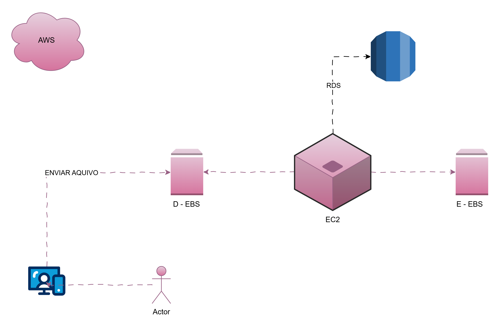
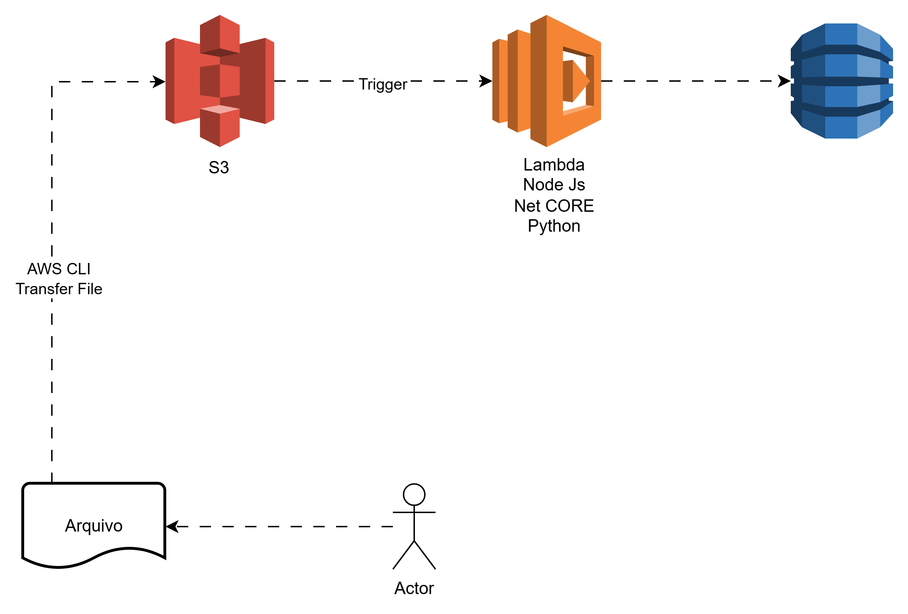

EC2 -> são maquinas virtuais na AWS tendo como SO Linux ou Windows 
-> suas instancias são do tipo IAAS ou seja, quando criada é utilizado o tipo infraestutura como serviço
--> Fornece capacidade de processamento (CPU, Memória RAM).
--> É "elástico". Se o seu site receber muito acesso, você pode criar mais instâncias EC2 em minutos para aguentar o tranco e desligá-las quando o movimento cair.

EBS -> é o disco rígido virtual de alta performance conectado diretamente ao EC2
-> Armazenamento em bloco persistente. Ele guarda o sistema operacional da sua máquina virtual, seus arquivos de configuração e bancos de dados.
--> Baixa latência e alta performance. Ele foi feito para o EC2 acessar arquivos muito rapidamente, de forma contínua.
--> Geralmente, um volume EBS só pode ser montado em uma instância EC2 por vez (como um HD físico).

S3-> é o serviço de armazenamento de objetos da AWS. Ele não serve para instalar sistemas operacionais, mas sim para guardar arquivos que você pode acessar de qualquer lugar do mundo via internet.
-> Guarda arquivos (fotos, vídeos, PDFs, backups, instaladores) organizados em "Buckets" (que funcionam como pastas gigantes).
--> Durabilidade e escala. O S3 foi desenhado para nunca perder um arquivo (99.999999999% de durabilidade) e você pode guardar desde 1 KB até Petabytes de dados sem se preocupar com falta de espaço.
--> O EC2 não roda o sistema operacional direto do S3. O S3 é acessado via API (HTTP/HTTPS). Qualquer aplicação ou usuário autorizado na internet pode ler ou gravar dados nele.

